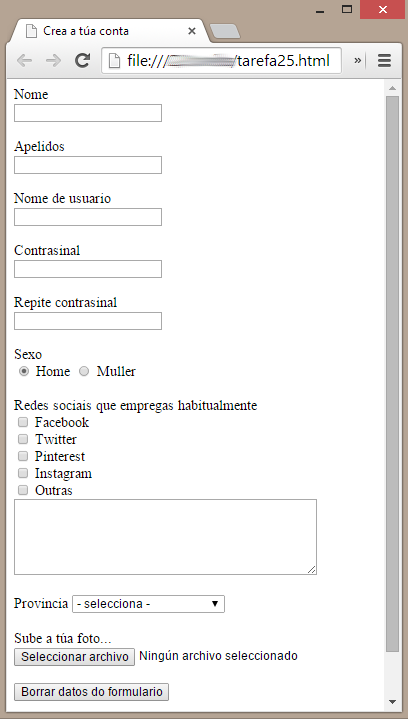


# Conta de usuario

Editar un formulario para crear unha conta de usuario empregando os diferentes controis que ofrece HTML. Débense empregar, como mínimo, os seguintes controis: cadro de texto, contrasinal, controis de tipo radiobutton, controis de tipo checkbox, lista de selección, subida de arquivo, botón de borrado e botón de envío.

Podes facer uso de exemplos e código do sitio [https://www.w3schools.com/](https://www.w3schools.com/)
