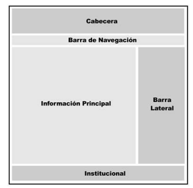
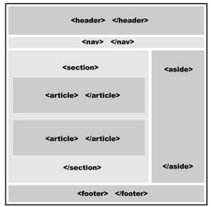

## Enunciado
Crear un documento HTML5 para el boceto de la imagen 1

utilizando el etiquetado semántico de la imagen 2

### Explicación de los componentes de la imagen 1
- Cabecera -> se encuentra el espacio donde usualmente se ubica el logo, título, subtítulos y una corta descripción del sitio web o la página.
- Barra de Navegación -> menú o lista de enlaces con el propósito de facilitar la navegación a través del sitio.
- Contenedor principal -> en el ejemplo se utilizaron solo dos columnas: Información Principal y Barra Lateral, pero esta sección es muy flexible y los diseñadores la suelen adaptanr según sus necesidades insertando más columnas, dividiendo cada columna entre bloques más pequeños...
	- **Información Principal** podría contener una lista de artículos, descripción de productos, entradas de un blog o cualquier otra información importante
	- **Barra Lateral** podría mostrar una lista de enlaces apuntando hacia cada uno se esos ítems
- Pie o barra institucional -> normalmente se muestra información acerca del sitio web, el autor o la empresa, además de algunos enlaces con respecto a reglas, términos y condiciones
