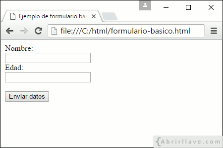
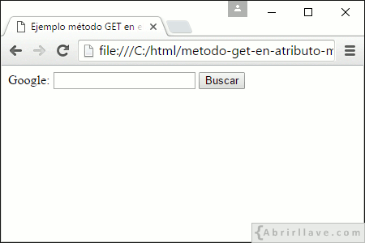
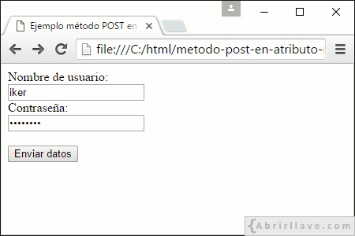
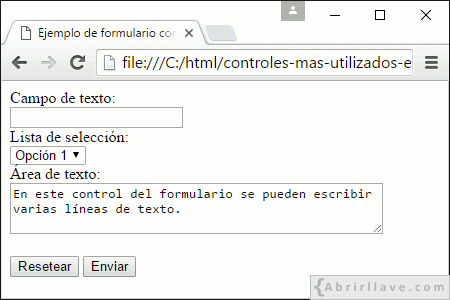
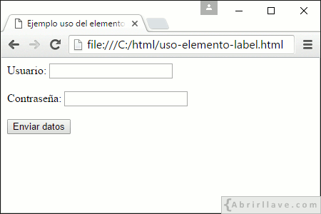


# FORMULARIOS HTML

1.  **Formulario básico - Elementos "form" e "input"**
  
**Ejercicio 1:** Crear un formulario sencillo con el nombre _**"formulario-basico.html"**_ con la siguiente apariencia:

2.  **Atributo action**
    
**Ejercicio 2:** Si el archivo _**"procesar-datos.php"**_ fuese el encargado de procesar los datos de un formulario, ¿qué atributo tendrías que añadir a la etiqueta <form>?

3.  **Atributo method**

**Ejercicio 3:** Utilizar el método GET en un formulario para realizar una búsqueda en _Google_ con la siguiente apariencia:

**Ejercicio 4:** ¿Qué ocurre si usamos el método POST?

**Ejercicio 5:** Crear un formulario usando el método POST para enviar los datos (usuario y clave) a la página _**"procesar-datos.php"**_ con la siguiente apariencia:

4.  **Controles de un formulario**

**Ejercicio 6:** Crear un formulario usando los controles: “button”, “input”, “select” y “textarea”

1.  **Elemento "label"**
    

**Ejercicio 7:** Utilizar la etiqueta <label> en el formulario del ejercicio 5 para que en la pantalla se muestre con este formato:

Podes facer uso de exemplos e código do sitio [https://www.w3schools.com/](https://www.w3schools.com/)
