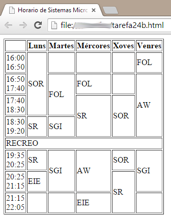
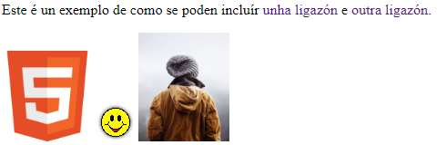


## Horario de clases

Crea  un documento ****HTML****que muestre  tu horario de clase. 



****O********J********O****: no se pueden poner elementos duplicados, i.e, no podemos poner 2 veces DIW si no una vez DIW si ocupa 2 horas seguidas.

_Opcional_: añadir estilos para hacerla visualmente más agradable.


## LINKS E IMAXES

a) Crear a seguinte páxina web:




coas 3 imaxes adxuntas:

 -  icono html5
 - smiley
 - img_girl
    
    A primeira ligazón ten que abrir o ficheiro de imaxe do icono smiley.
    
    A segunda ligazón é á páxina do instituto [https://www.iessanclemente.net/](https://www.iessanclemente.net/) que se abrirá nunha nova ventá.
    
    A cor das ligazóns pasará a ser vermella cando se visite cada enlace, se non usaranse as cores por defecto.
    
    A imaxe do icono html5 terá un enlace ao tutorial HML5 de w3schools.
    
    A imaxe do icono smiley levará un texto descritivo “icono de sorriso”
    
    Á imaxe da rapaza hai que darlle as seguintes dimensións: 100 pixels de ancho e 200 de alto.
    
    Podes facer uso de exemplos e código do sitio [https://www.w3schools.com/](https://www.w3schools.com/)
    
 b) Cita as 3 formas que hai de engadir CSS ao código HTML. Que sucede se na imaxe anterior da rapaza empregamos os atributos width e height dentro do elemento imaxe e logo engadimos o seguinte elemento de estilo no header da páxina html ?
    
```
<head>
<style>
/* This stylesheet sets the width of all images to 100%: */
img {
width: 100%;
}
</style>
</head>
```
Como podemos evitar que isto suceda?
  

c) Como farías para mover o icono smiley á dereita da liña de texto da páxina ?

  

d) Que é un bookmark. Describe un exemplo de aplicación.


Podes usar a seguinte aplicación para comprobar que o código HTML é válido: [https://validator.w3.org/](https://validator.w3.org/)


