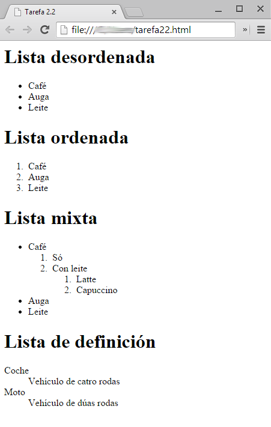


# Tipos de listas

Facendo uso dun editor HTML (p.ex. Brackets) crea unha páxina HTML co seguinte contido:

Podes facer uso de exemplos e código do sitio [https://www.w3schools.com/](https://www.w3schools.com/)
